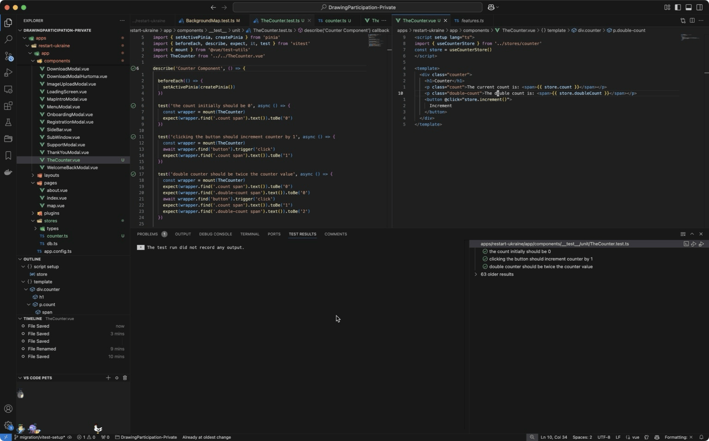
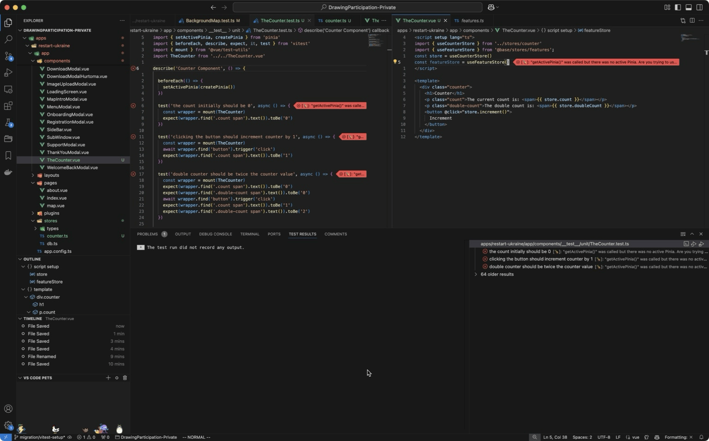

## Issues with testing in Restart-Ukraine

Component that I tried to test is BackgroundMap.vue relied on @base/stores/feature, which vitest and pinia some how does not recognize.

Some example that I follow:

https://fadamakis.com/unit-testing-a-pinia-component-37d045582aed

However, the use of store in this project is different, we're using layers to extends our project.

Here is a simple demonstration:

This means that I couldn't test any of the component in Restart-Ukraine that utilized the pinia base stores. The test case wouldn't run.

I did some research and found that there are other people who is also have a the same errors/problems:

https://github.com/vuejs/pinia/discussions/2378

https://github.com/vuejs/pinia/pull/2699

https://github.com/vuejs/pinia/issues/2555

https://github.com/vuejs/pinia/issues/2820

Resource that I checked:
https://pinia.vuejs.org/core-concepts/outside-component-usage.html

**Updating the package @pinia and @pinia/nuxt seems to get rid of error**
